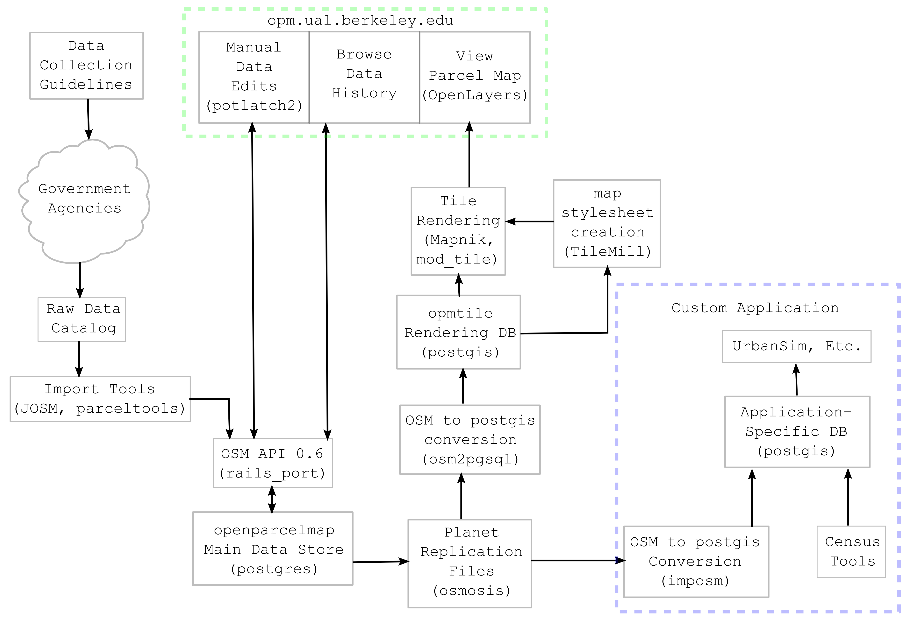

Server Setup
============

OpenParcelMap relies on a number of components.  I'm mostly documenting this
here for easier administration.  But perhaps these notes are handy.  Before you
proceed, you should understand the following system diagram.

This diagram is shamelessly inspired by the OSM [component
overview](http://wiki.openstreetmap.org/wiki/Component_overview).  BTW, these
are all instructions for Ubuntu.

rails port
==========

The [rails port](http://wiki.openstreetmap.org/wiki/The_Rails_Port) is the API
server used by OSM.  The first step here is to set up an instance of the rails
port for collecting parcel data.  Here are some notes:

* I deployed the production code to /srv/openparcelmap/openstreetmap-website by
  cloning the forked repository.  I set the permissions so that anyone in the
  www-data group (including me and apache) can read and write.

  <pre>
sudo mkdir -p /srv/openparcelmap
sudo chown yourname.yourgroup /srv/openparcelmap/
cd /srv/openparcelmap
git clone git@github.com:ual/openstreetmap-website.git
sudo chown -R www-data:www-data openstreetmap-website/
sudo chmod -R g+w openstreetmap-website/
sudo chmod -R g+s openstreetmap-website/
  </pre>

* I used the [Phusion Passenger](http://www.modrails.com/documentation/Users%20guide%20Apache.html#_deploying_a_rack_based_ruby_application_including_rails_gt_3)
  to run the application under apache.

* I edited the configuration in config/application.yml so that the application
  could send email.  Note that for this to work I had to "apt-get install
  sendmail-base sendmail"

osmosis
=======

Osmosis feeds the Internet with planet dumps.  The main reference for osmosis
is: http://wiki.openstreetmap.org/wiki/Osmosis/Detailed_Usage.  We are using
osmosis like planet.openstreetmap.org as described here:
http://wiki.openstreetmap.org/wiki/Osmosis/Replication

1. Make an osmosis user and create all of the directories that she needs.

   <pre>
sudo adduser --system osmosis
sudo mkdir /var/www/planet
sudo chown osmosis.nogroup /var/www/planet
sudo passwd osmosis
sudo usermod -s /bin/bash -a -G sys osmosis
   </pre>

2. Login as the osmosis user and set a few things up:
   <pre>
su osmosis 
echo 'export PATH=~/bin:$PATH' >> ~/.bashrc
echo 'JAVACMD_OPTIONS="-Xmx16G -server"' > ~/.osmosis
source ~/.bashrc
mkdir -p ~/bin ~/app/osmosis
   </pre>

3. Fetch, install, and setup the latest osmosis:
   <pre>
cd ~/app/osmosis
wget http://bretth.dev.openstreetmap.org/osmosis-build/osmosis-latest.tgz
tar -xzf osmosis-latest.tgz
ln -s ~/app/osmosis/bin/osmosis ~/bin/osmosis
ln -s /var/www/planet ~/planet
mkdir -p ~/app/replicate/data
mkdir -p ~/app/replicate-hour/data
mkdir -p ~/app/replicate-day/data
   </pre>

4. Create an auth file for osmosis to user to access the rails port DB.  I do
   this in ~/opm.auth.  The contents should look like this.
   <pre>
host=localhost
database=openparcelmap
user=openparcelmap
password=yourpassword
dbType=postgresql
   </pre>
   I recommend restricting read access to this file since it contains a password:
   <pre>
chmod 600 opm.auth
   </pre>

5. Create the first planet dump
   <pre>
osmosis --read-apidb authFile=~/opm.auth validateSchemaVersion=no \
        --write-xml /var/www/planet/planet-latest.osm.bz2
   </pre>

6. Create replication directory layout
   <pre>
mkdir -p /var/www/planet/replication
mkdir -p /var/www/planet/replication/minute
   </pre>

7. Create a single replication:
   <pre>
    osmosis -q --replicate-apidb authFile=~/opm.auth 
            allowIncorrectSchemaVersion=true --write-replication \
            workingDirectory=/var/www/planet/replication/minute/
   </pre>

tile rendering database
=======================

Tiles are rendered from a postgis database that is regularly sync'd with the
planet dumps.  See http://wiki.openstreetmap.org/wiki/Minutely_Mapnik

0. If you haven't already, grab parceltools.  All of the following commands
   assume that you are in the parceltools directory.

   <pre>
git clone git://github.com/ual/parceltools.git
cd parceltools
   </pre>

1. Create a suitable user and DB

   <pre>
createuser -S -D -R -P opm
createdb -O opm opmtile_dev
createdb -T template_postgis opmtile_dev
   </pre>

   Note: I set up my .pgpass file so that I can perform the following tasks
   without entering the opm password over and over.

2. Make a directory where you will keep all of this stuff

   <pre>
mkdir /srv/openparcelmap/opmtile/
export OPMTILE=/srv/openparcelmap/opmtile/
sudo touch /var/log/opmtile.log
sudo chown $USER /var/log/opmtile.log
   </pre>

3. Get [the latest planet file](http://planet-opm.ual.berkeley.edu/planet-latest.osm.bz2).

4. Import planet file:

   <pre>
bunzip2 -c planet-latest.osm.bz2 | \
osm2pgsql -s -S opmtile/opmtile-osm2pgsql.style -d opmtile_dev -U opm -H localhost /dev/stdin
   </pre>

5. Set up the replication files:

   <pre>
osmosis --read-replication-interval-init workingDirectory=$OPMTILE
   </pre>

   Edit the resulting configuration.txt file to point
   baseUrl=http://planet-opm.ual.berkeley.edu/replication/minute

6. Create a state.txt file.

   <pre>
sequenceNumber=0
txnMaxQueried=2363
txnReadyList=
timestamp=2013-04-21T14\:36\:05Z
txnMax=2363
txnActiveList=
   </pre>

   I created this by subtracting 2h from the timestamp of the
   http://planet-opm.ual.berkeley.edu/replication/minute/000/000/000.state.txt
   file.  This little bit of bookeeping is a kinda painful weakness in the OSM
   stack, IMHO.

7. Fetch and apply replication data.  Note that if you are not using the exact
   same directory names as described above (i.e., /srv/openparcelmap/opmtile/)
   you will have to edit the opmtile.sh script.

   <pre>
./opmtile/opmtile.sh
   </pre>

   Expect the state.txt file to update.  Note that if the command fails, the
   state.txt file will be reverted so that subsequent invocations will try
   again.  Expect logging output to appear in syslog.

8. Repeat steps 5 periodically.  When the state.txt file stabilizes, you're up
   to date.  Consider automating this with cron.

tile renderer
=============

We use mod_tile and mapnik to render tiles.
